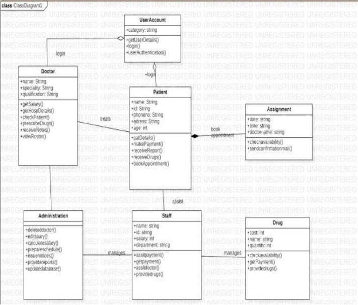
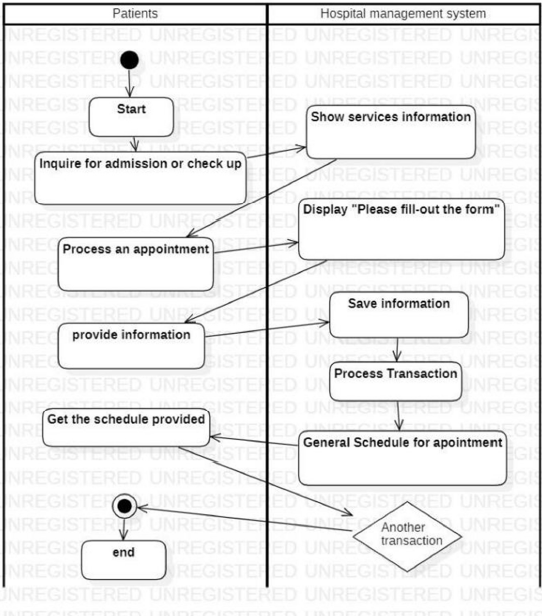
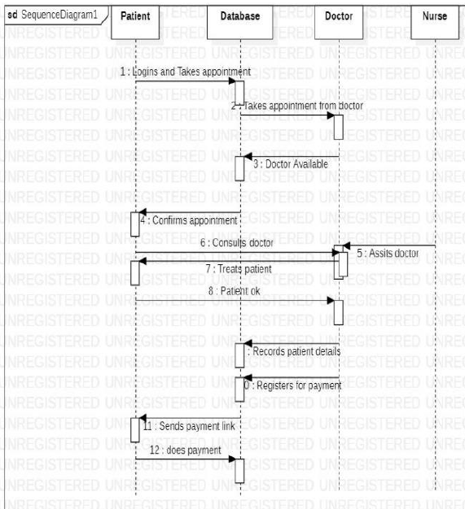
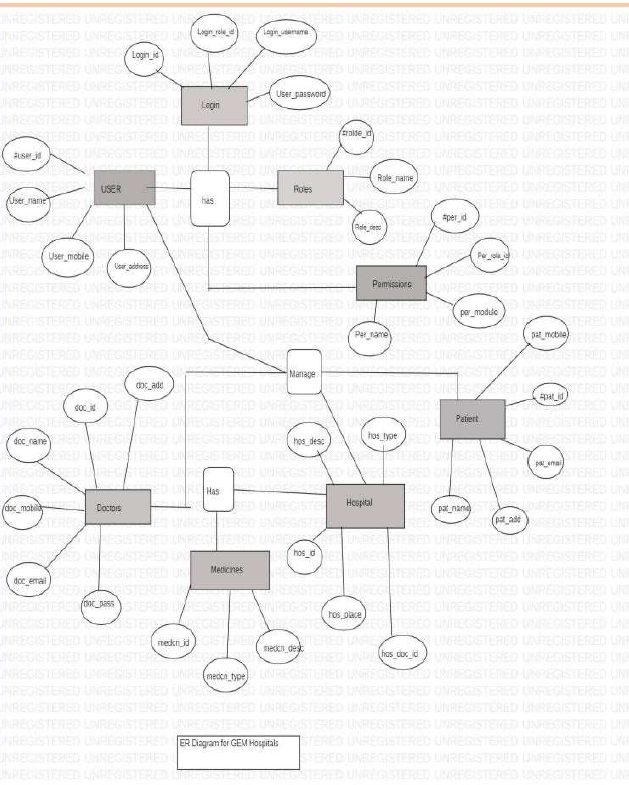

# Testing of Hospital Website

This repository contains the test automation suite for the **Gem Hospital Coimbatore** website. The project focuses on automating the testing process for key modules, including Consultation, Payment, Doctor Details, Patient Information, and Facilities, using tools like **Selenium**, **JUnit**, and **Postman**. The tests ensure that the hospital’s website functions smoothly, is reliable, and meets the highest standards of security and performance.

## Table of Contents

1. [Project Overview](#project-overview)
2. [Tech Stack](#tech-stack)
3. [Project Features](#project-features)
4. [Setup Instructions](#setup-instructions)
5. [Running Tests](#running-tests)
6. [UML Diagrams](#uml-diagrams)
7. [Contributors](#contributors)

---

## Project Overview

The **Testing of Hospital Website** project is designed to test and validate the core functionalities of Gem Hospital’s digital platform. The test cases and automation scripts simulate real-world scenarios to ensure the website’s reliability, user-friendliness, and performance. The project focuses on:
- Automating UI tests using Selenium.
- Verifying backend functionality with Postman.
- Ensuring test reliability with JUnit.

---

## Tech Stack

- **Java**: Core programming language.
- **Selenium WebDriver**: For automating browser interactions.
- **JUnit**: For creating and running unit tests.
- **Postman**: For API testing.
- **Git**: For version control.

---

## Project Features

- **Consultation Module**: Automated testing of booking online consultations.
- **Payment Module**: Testing integration with payment gateways like Google Pay.
- **Doctor Details**: Ensuring functionality for displaying doctor information.
- **Patient Information**: Automating the display of patient records and information.
- **Facilities & Departments**: Testing navigation and display of hospital facilities and departments.

---

## Setup Instructions

Follow the steps below to set up and run the project on your local machine.

### Prerequisites

- **Java JDK** (version 8 or higher)
- **Maven** (for managing dependencies)
- **Selenium WebDriver**
- **JUnit 5**
- **Postman** (for API testing)
- **Git** (for cloning the repository)
- A modern web browser (e.g., Chrome or Firefox)

### Clone the Repository

To clone this repository to your local machine, run the following command:

```bash
git clone https://github.com/username/testing-hospital-website.git
```

## Setup Instructions

### Setting Up Selenium WebDriver

1. Download the latest Selenium WebDriver for your preferred browser:
   - [ChromeDriver](https://sites.google.com/a/chromium.org/chromedriver/downloads)
   - [GeckoDriver](https://github.com/mozilla/geckodriver/releases) for Firefox.

2. Extract the WebDriver to a known directory.

3. Add the WebDriver path to your system's PATH variable for easy access.

### Install Maven Dependencies

Navigate to the project directory and run the following command to install the required dependencies:

```bash
mvn install
```
## Set Up Postman for API Testing

1. Install [Postman](https://www.postman.com/downloads/).
2. Import the provided API collections from the `/postman-collections` directory.
3. Set up environment variables (if required) for the API tests.

---

## Running Tests

### Running Selenium Tests

Once you have set up the project, you can run the Selenium tests by executing the following Maven command:

```bash
mvn test
```
This will trigger the UI automation tests that verify the hospital’s website functionalities.

## Running JUnit Tests

JUnit tests can be run directly from your IDE or using Maven with the following command:

```bash
mvn test -Dtest=TestClassName
```

## Running Postman API Tests

Open Postman and import the collections from the <code>/postman-collections</code> folder.
Run the test collection to verify API endpoints.

## UML Diagrams

### Class Diagram


### Activity Diagram


### Sequence Diagram


### ER Diagram


@#$%^&%#$%^^%$%%$%^#$%^^%$%&^$%^&$%^&
